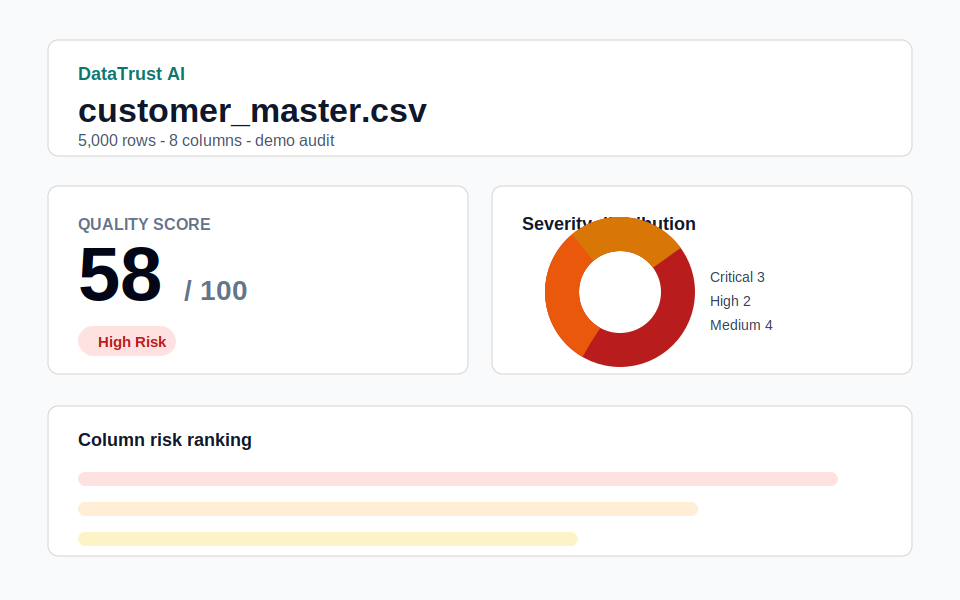
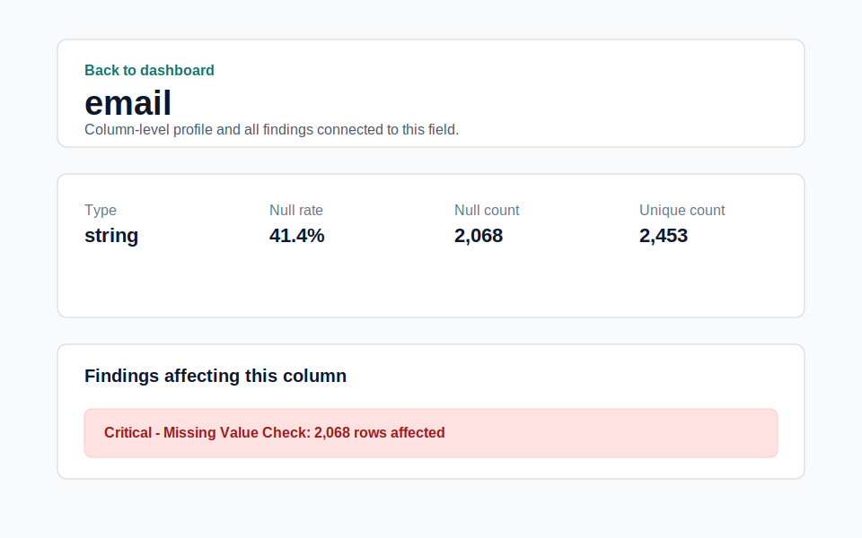
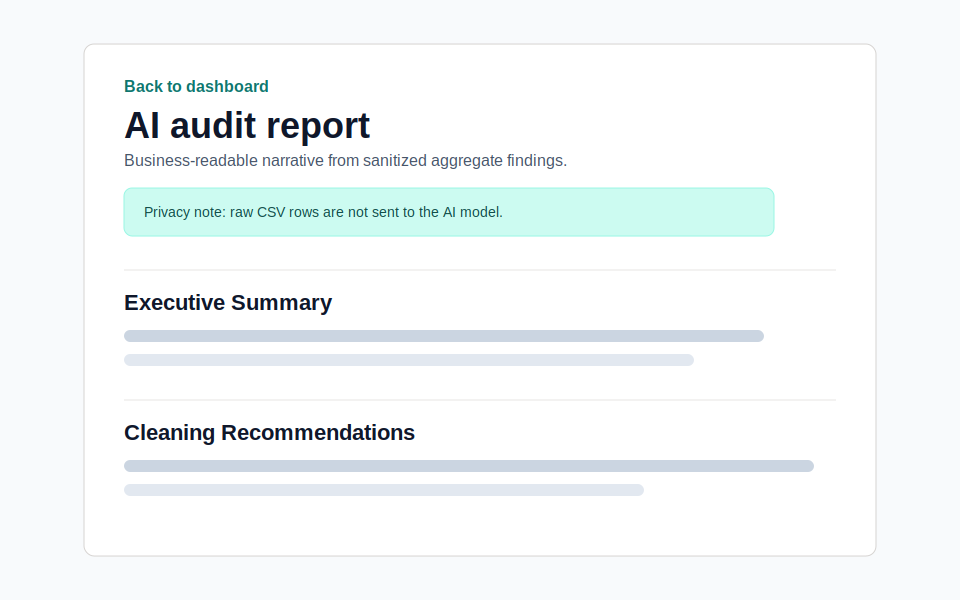
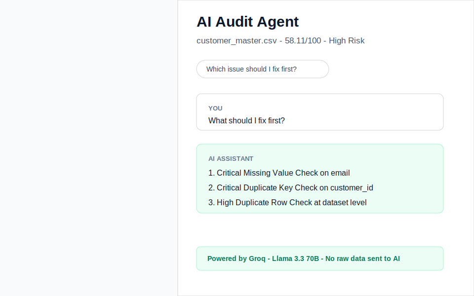

# DataTrust AI - Automated Data Quality Auditor

> Rules detect the issues. AI explains the business impact.

<!-- Add a demo GIF here after recording a 30-second screen capture. -->
<!-- Recommended flow: load customer_master demo -> dashboard -> AI report -> agent chat. -->

## What It Does

DataTrust AI helps analysts catch data quality problems before a dataset reaches dashboards, models, or executive reporting. The backend profiles uploaded CSV/TSV files, runs 11 deterministic validation rules, and computes a weighted 0-100 quality score. The key differentiator is privacy-safe AI: rules detect the issues, Groq explains the business impact, and raw CSV rows never reach the AI model.

## Live Demo

Hosted deployment URL: https://data-trust-ai.vercel.app

## Screenshots

| Dashboard | Column Profile |
|---|---|
|  |  |

| AI Report | Audit Agent |
|---|---|
|  |  |

## How The AI Integration Works

The core design principle: **rules detect the issues, AI explains the business impact.**

The backend runs 11 deterministic validation rules against the uploaded dataset. Each rule returns structured findings: which column is affected, how many rows are affected, what percentage of the dataset is affected, the severity level, and a suggested fix. These findings are assembled into a canonical audit JSON object that powers the frontend, exports, PDF report, AI summary, and AI agent.

Before any AI call, a sanitization step strips fields that could contain raw data values, including `sample_values`, `top_values`, `raw_values`, and `row_data`. The AI model receives only aggregated statistics: column names, counts, percentages, severity labels, and suggested fixes. No CSV rows ever reach the AI.

The AI layer has two jobs:

1. **Static report** - converts structured findings into a four-section business-readable document: executive summary, risk interpretation, cleaning recommendations, and dashboard impact.
2. **Audit agent** - answers conversational questions about the specific audit findings using the same sanitized context injected as a system prompt.

### AI Provider

The agent uses **Groq** serving Llama 3.3 70B. Groq has a free tier and works well for local portfolio demos. If `GROQ_API_KEY` is not set, the agent uses a smart rule-based fallback that still produces data-specific answers from the audit JSON, referencing actual column names, row counts, percentages, and severity levels. The project is fully demonstrable without an API key.

### Why Not OpenAI?

Groq's free tier makes the project easier for anyone to clone and reproduce without a paid API account. The Groq API uses a familiar chat-completions shape, so the integration stays simple while keeping the project economical for an open-source portfolio build.

## Architecture

```text
CSV Upload
    |
    v
Profiler (pandas)
    |  per-column stats: null_pct, unique_count, inferred_type, numeric_summary
    v
Rules Engine (11 rules)
    |  RuleResult[]: severity, affected_column, affected_count, suggested_fix
    v
Scoring Engine
    |  weighted composite score: missing(25%) + duplicates(20%) + types(20%)
    |                           + outliers(10%) + critical(15%) + rules(10%)
    v
AuditJSON --------------------------------------------------------------+
    |                                                                  |
    v                                                                  v
AI Summary (Groq)                                           AI Agent (Groq)
sanitize -> prompt -> narrative                             sanitize -> system prompt
four sections returned                                      + conversation history
    |                                                                  |
    +-----------------------------+------------------------------------+
                                  v
                           React Frontend
             Dashboard | Column Profile | Issue List | AI Report
                    Download Exports | Chat Agent
```

## Tech Stack

| Layer | Technology | Why |
|---|---|---|
| Frontend | React + TypeScript | Component model suits the multi-page dashboard structure |
| Styling | Tailwind CSS | Utility classes keep styling consistent without a custom design system |
| Charts | Recharts | Composable React-native charting without D3 complexity |
| State | Zustand | Lightweight global store without Redux ceremony |
| Routing | React Router v6 | Client-side navigation for dashboard subpages |
| Backend | FastAPI | Typed Python API with automatic OpenAPI docs and fast iteration |
| Data processing | pandas | Industry-standard tabular profiling and validation |
| AI provider | Groq (Llama 3.3 70B) | Free tier, low latency, strong enough for audit explanations |
| PDF export | WeasyPrint | Server-side HTML-to-PDF for stakeholder-ready reports |
| Frontend deploy | Vercel | Free-tier static hosting and preview deployments |
| Backend deploy | Render | Python web service deployment with managed environment variables |
| Tests | pytest + Vitest | Backend service/API coverage and frontend component coverage |

## Rules Engine

| # | Rule | Category | What It Checks | Severity Thresholds |
|---|---|---|---|---|
| 1 | Missing Value Check | Completeness | Null/empty values per column | Low <=5%, Medium >5%, High >15%, Critical >35% |
| 2 | Duplicate Row Check | Uniqueness | Exact duplicate rows | Low <=0.5%, Medium >0.5%, High >2%, Critical >5% |
| 3 | Duplicate Key Check | Uniqueness | Non-unique ID column values | Critical when any non-unique IDs exist |
| 4 | Invalid Type Check | Validity | Values not matching inferred type | Low <=2%, Medium >2%, High >10%, Critical >20% |
| 5 | Outlier Detection | Accuracy | IQR-based extreme numeric values | Low <=5%, Medium >5%, High >15% |
| 6 | Category Consistency | Consistency | Same category in variant forms | Low 1-2 clusters, Medium 3-5, High >5 or many variants |
| 7 | Date Format Check | Conformity | Mixed or unparseable date formats | Low 2 patterns, Medium 3 patterns, High >=4 patterns or parse failures |
| 8 | Numeric Range Check | Accuracy | Domain-inappropriate values by column name | Low 1-2, Medium 3-10, High >10 or >1% |
| 9 | Text Formatting | Conformity | Leading/trailing whitespace and unexpected caps | Low by default, Medium when >=10% |
| 10 | Freshness Check | Timeliness | Most recent date value is significantly old | Low 30-60d, Medium 61-180d, High >180d |
| 11 | Referential Integrity | Integrity | Chronologically inverted column pairs | Low 1-2, Medium 3-10, High >10 or >0.5% |

## Scoring Methodology

**Formula:** `score = max(0, round(100 - sum(weight_i * penalty_i / 100)))`

| Component | Weight | Penalty Calculation |
|---|---:|---|
| Missing values | 25% | Worst missing-value rule percentage |
| Duplicate rows | 20% | Duplicate row percentage multiplied by severity multiplier |
| Invalid type | 20% | Worst invalid-type or date-format percentage multiplied by severity multiplier |
| Outliers | 10% | Worst outlier percentage multiplied by severity multiplier |
| Critical failures | 15% | Aggregate severity-weighted percentage of Critical findings, capped |
| Business rules | 10% | Severity-weighted total across ranges, integrity, freshness, text, and category rules |

**Severity multipliers:** Critical x3, High x2, Medium x1, Low x0.5.

**Score tiers:** 90-100 Excellent, 75-89 Good, 60-74 Needs Review, below 60 High Risk.

Important consistency rule: if a non-empty dataset has zero rule findings, it scores exactly 100/100. Deductions are derived from visible `RuleResult` objects so the score and issue list cannot disagree.

## Running Locally

Prerequisites: Python 3.11+, Node.js 18+, Git.

```bash
# 1. Clone the repository
git clone https://github.com/your-username/datatrust-ai.git
cd datatrust-ai

# 2. Set up environment variables
cp .env.example .env
# Optional: add your GROQ_API_KEY from https://console.groq.com

# 3. Install and start the backend
cd backend
python3 -m venv .venv
source .venv/bin/activate
pip install -r requirements.txt
uvicorn app.main:app --reload --host 127.0.0.1 --port 8000
```

In a new terminal:

```bash
cd frontend
npm install
VITE_BACKEND_URL=http://127.0.0.1:8000 npm run dev -- --host 127.0.0.1 --port 5173
```

Open:

```text
http://127.0.0.1:5173
```

Optional: generate sample datasets.

```bash
python3 scripts/generate_sample_datasets.py
```

Optional: run tests.

```bash
cd backend
.venv/bin/python -m pytest -q

cd ../frontend
npm test
npm run build
```

## Deployment

### Frontend (Vercel)

1. Push the repository to GitHub.
2. Go to [vercel.com](https://vercel.com) and import the repository.
3. If deploying from the root, use the included root `vercel.json`. If deploying from `frontend/`, use `frontend/vercel.json`.
4. Add this environment variable in the Vercel dashboard:
   - `VITE_BACKEND_URL` -> your deployed backend URL, for example `https://datatrust-ai-backend.onrender.com`
5. Deploy. The rewrite rule ensures React Router paths serve `index.html`.

### Backend (Render)

1. Go to [render.com](https://render.com) and create a new Web Service, or use the included `render.yaml`.
2. Connect your GitHub repository.
3. Set build command:
   ```bash
   pip install -r backend/requirements.txt
   ```
4. Set start command:
   ```bash
   uvicorn backend.app.main:app --host 0.0.0.0 --port $PORT
   ```
5. Add environment variables:
   - `GROQ_API_KEY` -> your Groq key from `https://console.groq.com`
   - `GROQ_MODEL` -> `llama-3.3-70b-versatile`
   - `ALLOWED_ORIGINS` -> your Vercel frontend URL, for example `https://datatrust-ai.vercel.app`
6. Deploy.

Important: set `ALLOWED_ORIGINS` on the backend to exactly match your Vercel frontend URL. Without this, the browser will block frontend-to-backend calls due to CORS.

## Sample Datasets

| Dataset | Rows | Key Issues Seeded | Expected Score |
|---|---:|---|---|
| `customer_master.csv` | 5,000 | Duplicate `customer_id` values, missing `email`, duplicate rows, country variants, impossible ages, invalid revenue strings | 55-65 |
| `sales_transactions.csv` | 15,000 | Mixed order date formats, ship-before-order rows, negative totals, category variants, discounts over 100, exact duplicates | 68-78 |
| `hr_employees.csv` | 1,200 | Duplicate employee IDs, salary outliers, department code/name variants, sparse termination dates, hire-after-termination rows, status variants | 62-72 |

## Privacy Statement

Uploaded files are processed ephemerally by the backend audit pipeline. The app does not store CSV rows in a database. The AI model receives only sanitized aggregate findings: column names, row counts, percentages, severity labels, descriptions, and recommended fixes.

Raw data values, individual cell contents, and data rows are never included in AI prompts. This is enforced by `sanitize_audit_context`, which strips raw-value fields before every Groq call.

## Known Limitations

- Very large CSV files may be slow or time out on free-tier hosting.
- AI summaries are first drafts and should be reviewed before executive distribution.
- IQR-based outlier detection can flag legitimate rare business cases.
- Rule checks detect structural problems; they cannot prove real-world correctness.
- The tool recommends fixes but never modifies source data.

## Resume Bullets

**Data Analyst**

- Built a full-stack automated data quality auditor with Python/FastAPI and React that profiles CSV datasets, runs 11 deterministic validation rules, and produces weighted 0-100 quality scores with severity-ranked findings.
- Designed privacy-safe AI reporting with Groq, converting structured rule findings into business-readable summaries without sending raw data rows to the model.
- Implemented an AI audit agent that answers plain-English questions about specific findings using actual column names, row counts, and percentages from the audit result.

**BI Analyst**

- Developed an interactive data quality dashboard with severity distribution, missing-value analysis, score breakdowns, column risk ranking, completeness heatmaps, and exportable issue lists.
- Automated pre-dashboard quality checks for duplicates, mixed date formats, invalid numeric ranges, category variants, outliers, and chronological integrity issues.

**Business Analyst**

- Built an end-to-end audit workflow that translates technical data quality findings into executive summaries, prioritized cleanup recommendations, dashboard risk explanations, and PDF reports.
- Designed a conversational audit assistant that helps stakeholders understand which data issues matter first and how they affect reporting decisions.

## License

MIT
